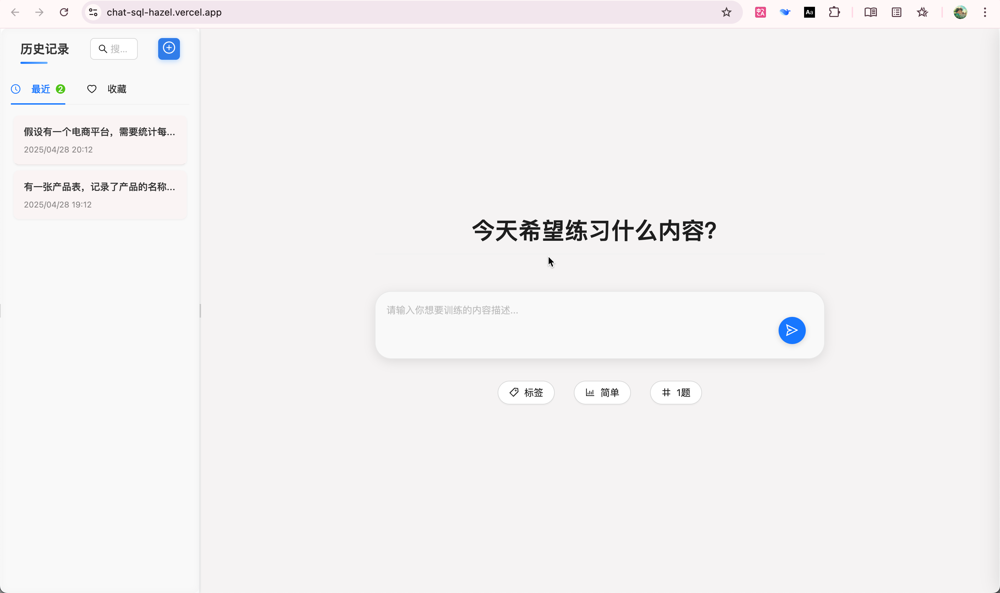
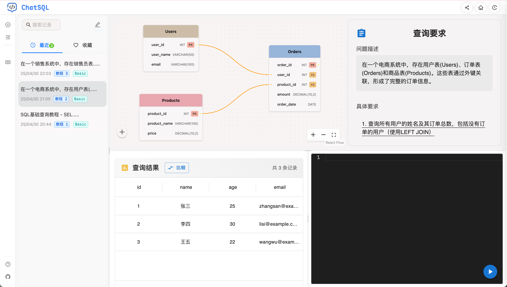

# 𝐜𝐡𝐚𝐭𝐒𝐐𝐋

[English](./README_EN.md) | 简体中文

<p align="center">
  
  
  
  
</p>

ChatSQL 是一个交互式 SQL 学习平台，通过 AI 生成练习题帮助用户掌握 SQL 查询语言。

## ✨ 特性

- 🤖 AI 生成练习：根据难度和标签自动生成 SQL 练习题
- 📊 数据库结构可视化：直观展示表关系和字段信息
- ⌨️ 智能代码编辑器：支持语法高亮和自动补全
- 📝 即时结果验证：实时验证查询结果

## 🖥 界面预览

### 初始化界面


### 数据库结构可视化


### SQL 编辑器演示


## 🛠 技术栈

<p align="left">
  
  
  
  
  
  
  
</p>

- **框架**: Next.js 15.3.0
- **UI 组件**:
  - Ant Design 5.24.6
  - Material-UI 7.0.2
- **编辑器**: Monaco Editor
- **流程图**:
  - XY Flow (@xyflow/react)
  - 用于数据库表关系可视化
  - 支持自定义节点和边的样式
  - 提供图表交互操作
  - 基于 D3.js 的缩放和拖拽功能
- **AI 集成**: Dify.ai
- **类型检查**: TypeScript

## 🚀 快速开始

### 前置要求

- Node.js 18.0 或更高版本
- npm 包管理器
- Dify.ai 账号和 API 密钥

### 安装步骤

1. 克隆仓库

```bash
git clone https://github.com/ffy6511/chatSQL.git
cd chatSQL/chat-sql
```

2. 安装依赖

```bash
npm install
```

3. 配置环境变量

```bash
touch .env
```

编辑 `.env` 文件并添加你的 Dify API 密钥：

```
NEXT_PUBLIC_DIFY_API_KEY=your_api_key_here
```

4. 启动开发服务器

```bash
npm run dev
```

### Dify 工作流配置

1. 在 [Dify 平台](https://dify.ai) 创建新应用（选择工作流）
2. 导入工作流配置：
   - 从项目中下载 `public/chatSQL.yml` 文件
   - 在 Dify 平台中导入该配置文件
   - 
3. 获取 API 密钥并在个人设置中配置（工作流默认使用 Gemini，可根据需要修改）

## 🤝 贡献

欢迎提交 Pull Request 和 Issue！

## 📄 许可证

[MIT License](./LICENSE)

