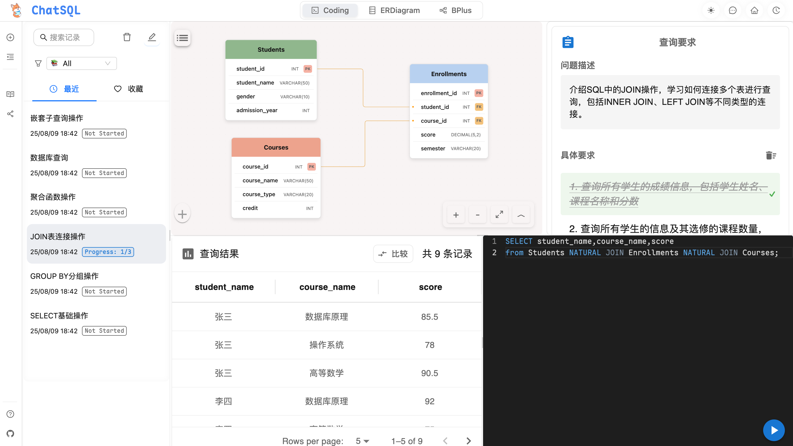
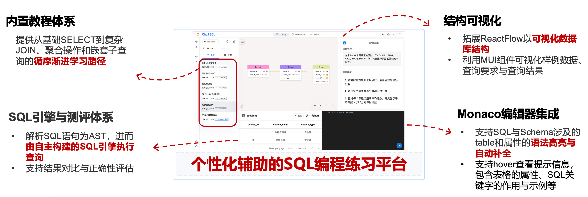
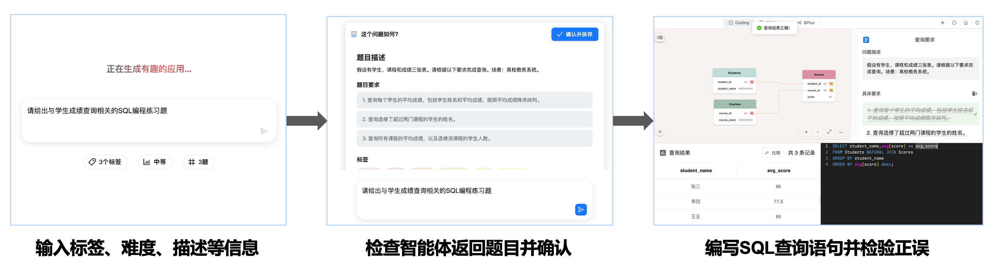
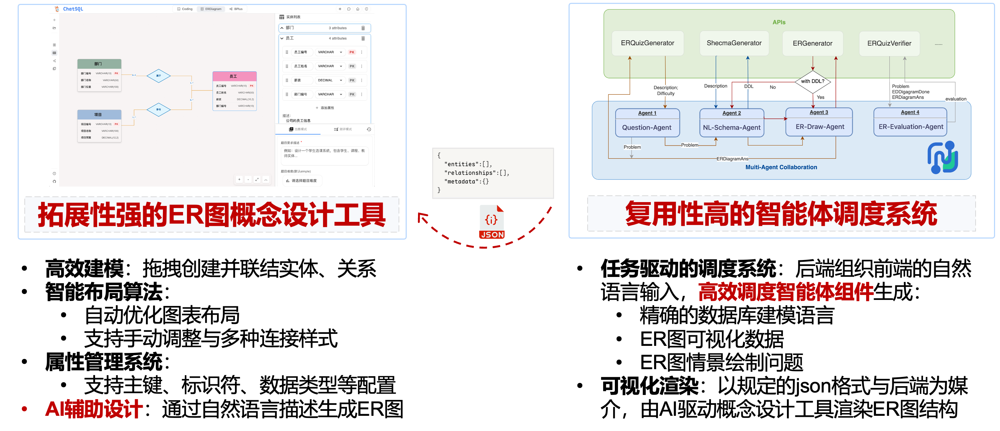
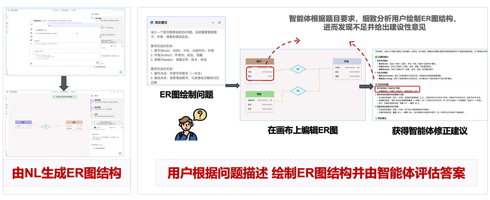
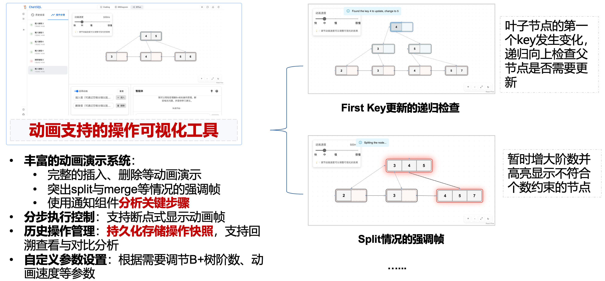
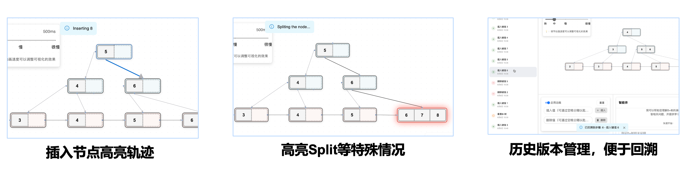
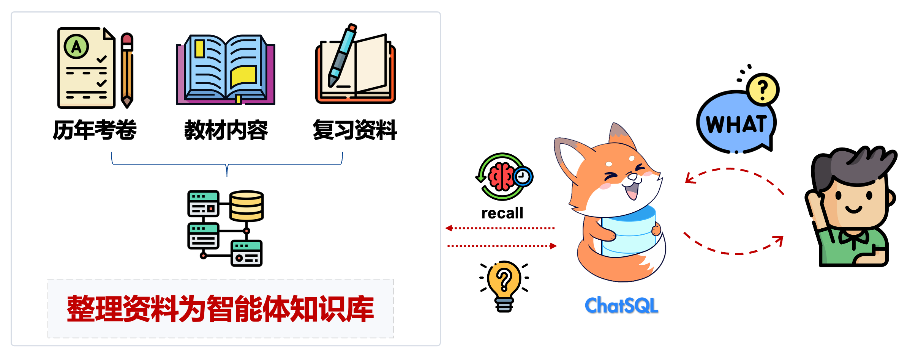
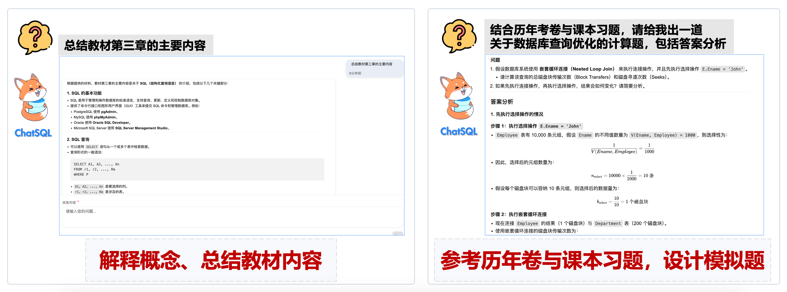
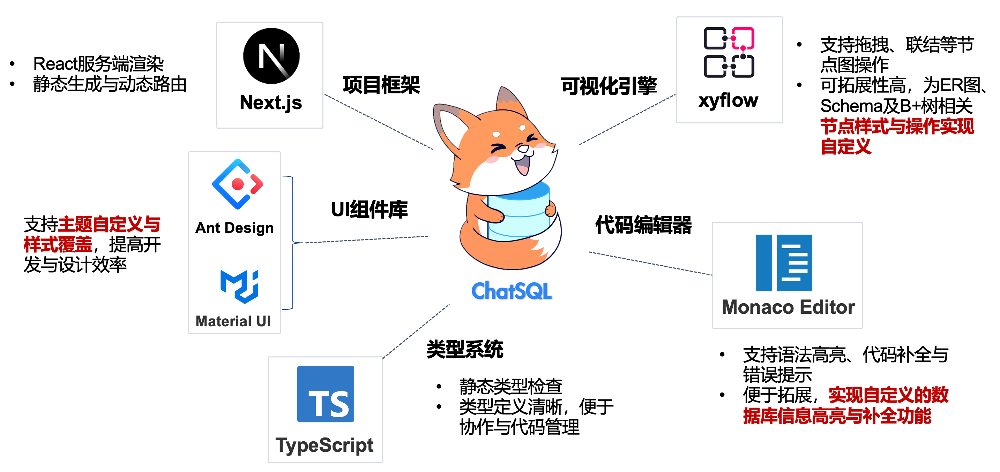

<h1 align="center">
  <a href="https://chat-sql-hazel.vercel.app/" target="_blank">
    
  </a>
</h1>


English | [简体中文](./README.md)

<p align="center">
  
  
  
  
  <a href="https://deepwiki.com/ffy6511/chatSQL"></a>
</p>
<p align="center" style="font-size: 1.2em; margin: 20px 0;">
  <a href="https://chat-sql-hazel.vercel.app/" target="_blank" style="font-size: 1.2em; font-weight: bold;">Website</a>
</p>


C𝐡𝐚𝐭𝐒𝐐𝐋 is an interactive database system learning platform that helps users master SQL queries, ER diagram design, and B+ tree operations from beginner to advanced levels through intelligent agent design and workflow orchestration, combined with secondary development and deep adaptation of frontend components like xyflow.

## Core Module Introduction

C𝐡𝐚𝐭𝐒𝐐𝐋 consists of the following core modules:

- **SQL Programming Practice Module**: Provides users with SQL query practice, offering exercises from both Dify-generated and preset course sources
- **ER Diagram Design Module**: Provides ER diagram modeling tools, ER diagram modeling problem generation, and intelligent agent evaluation feedback
- **B+ Tree Operation Module**: Implements B+ tree operation visualization
- **ChatBot Module**: General Q&A based on professional knowledge base, assisting in database system course learning

### SQL Programming Practice Module

#### Feature Design



- 🤖 **AI-Generated Exercises**: Provides two sources of practice problems

  - Through preset tutorials, progressively practice `select`, `join`, aggregation operations, and nested subqueries.
  - Interact with Dify workflow to automatically generate SQL exercises by inputting difficulty, tags, and descriptions.
- 📊 **Database Structure Visualization**: Intuitively displays table relationships and field information, with foreign key constraints clearly visible
- ⌨️ **Monaco Editor with Schema Integration**:

  - Supports SQL syntax highlighting and hover syntax tips
  - Provides `tab` auto-completion based on current schema information
- 📝 **Instant Result Validation**: Real-time verification of query results

  - Supports comparing query results with expected results to evaluate query correctness

#### Runtime Results



### ER Diagram Design Module

#### Feature Design



#### Runtime Results



### B+ Tree Operation Module

#### Feature Design



#### Runtime Results



### ChatBot Module

#### Feature Design



#### Runtime Results



## Future Plans

### Socratic Dialogue Agent


## 🛠 Tech Stack

<p align="left">
  
  
  
  
  
  
  
</p>


- **Framework**: [Next.js](https://nextjs.org/)
- **UI Components**:
  - [Ant Design](https://ant.design/)
  - [Material-UI](https://mui.com/)
- **Editor**: [Monaco Editor](https://microsoft.github.io/monaco-editor/)
- **Flow Diagram**:
  - [XY Flow](https://reactflow.dev/) (@xyflow/react)
- **AI Integration**: [Dify.ai](https://dify.ai/) && [Alibaba Cloud Bailian](https://bailian.console.aliyun.com/?utm_content=se_1021228063&gclid=CjwKCAjw49vEBhAVEiwADnMbbN8YRdE4pNrz9txN0_KcUqiOuUc9aPSgyMDqlti1KVOPf5-o-yL1jBoC3usQAvD_BwE#/home)
- **Type Checking**: [TypeScript](https://www.typescriptlang.org/)

## 🚀 Quick Start

> **TODO**: Provide intelligent agent/workflow design files for Bailian platform or migrate to Dify

### Prerequisites

- Node.js 18.0 or higher
- npm package manager
- Dify.ai account and API key

### Installation Steps

1. Clone the repository

```bash
git clone https://github.com/ffy6511/chatSQL.git
cd chatSQL/chat-sql
```

2. Install dependencies

```bash
npm install
```

3. Configure environment variables

```bash
touch .env
```

Edit the `.env` file and add your Dify API key:

```
NEXT_PUBLIC_DIFY_API_KEY=your_api_key_here
```

4. Start the development server

```bash
npm run dev
```

5. Update the git log: If you wish to update your own "changelog" interface, please execute

```bash
npm run generate-git
```

### Dify Workflow Configuration

1. Create a new application (select workflow) on [Dify platform](https://dify.ai)
2. Import workflow configuration:
   - Download the `public/chatSQL.yml` file from the project
   - Import this configuration file in the Dify platform
   - 
3. Get API key and configure in personal settings (workflow uses Gemini by default, can be modified as needed)

## 🤝 Contributing

Pull requests and issues are welcome!

## 📄 License

[MIT License](./LICENSE)
